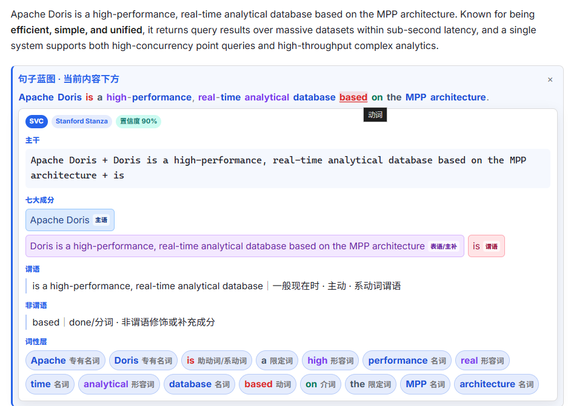
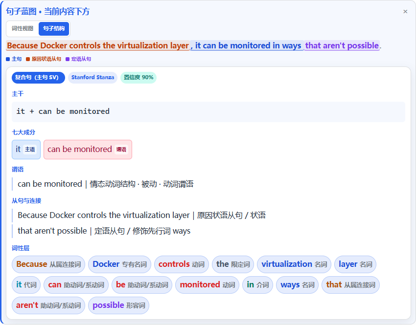
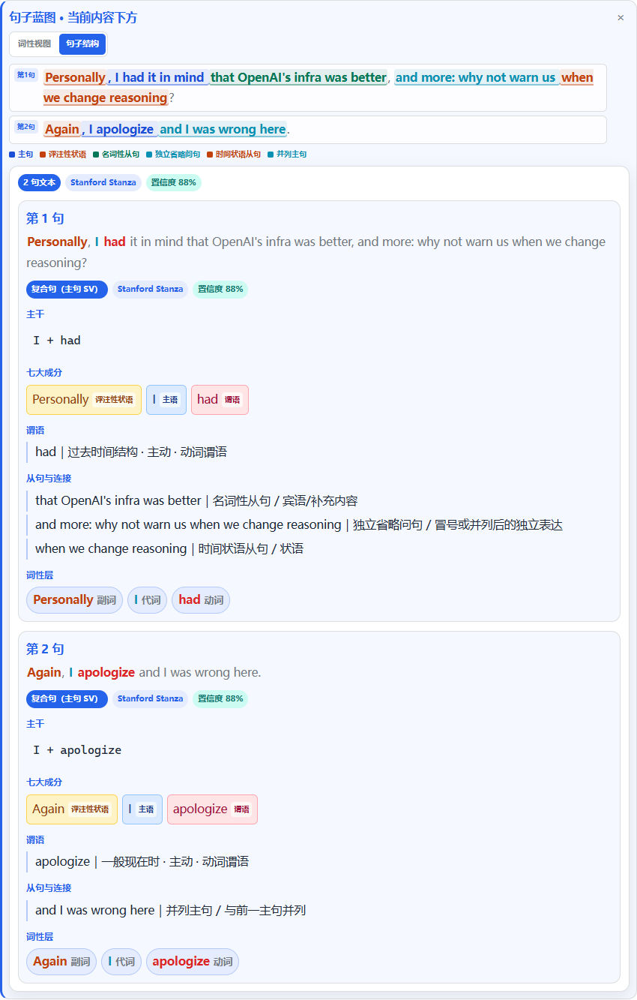

# 句子蓝图：沉浸式翻译第三行

> 0.5.0：多句选区会在结构视图中逐句分层；新增评注性状语、独立省略问句和并列主句识别，改善技术讨论、命令句、问句与口语片段混合段落的展示。

这是一个独立的 Chrome Manifest V3 扩展。它不会修改或复制“沉浸式翻译”的代码，而是观察该扩展在网页中生成的译文节点，并在译文下面增加第三行“句子拆解”。

## 当前功能

- 识别 `.immersive-translate-target-wrapper` 与 `.immersive-translate-target-translation-block-wrapper`。
- 在译文下自动增加一行可折叠的句子拆解入口。
- 按“谓语 → 连词 → 主干 → 从句 → 非谓语 → 修饰成分”的顺序展示。
- 区分句子成分与词性：主、谓、宾、表/补、定、状、同位语，以及名词、动词、形容词、副词等。
- 原句支持双视图切换：词性视图逐词标注，句子结构视图区分主句与各类从句；没有从句时自动切换为主谓宾补等成分标注。
- 多句文本在结构视图中显示“第1句、第2句……”边界，不再把整段未标注内容合并成一个主句。
- `Personally`、`Again` 等句首表达可标为评注性状语；带独立主语的 `conj` 和冒号后的 `why not ...` 省略问句会独立标注。
- 连字符复合修饰语会整体展示，例如 `high-performance｜复合形容词（作定语）`，避免把固定表达拆开讲。
- 支持右键或 `Alt+Shift+S` 拆解当前选中的英文。
- 本地服务优先使用 Stanford Stanza，并保留基础规则作为服务异常时的降级方案。
- 多句文本会自动分句并逐句展示，原始依存关系和成分树随分析结果缓存。
- 使用 SQLite 缓存已分析句子。

## 样式案例：词性着色

分析原句和下方“词性层”使用同一套词性配色，帮助阅读时快速区分句子骨架：名词为蓝色、动词为红色、形容词为紫色、代词为青色，介词、连词、限定词等也有各自的低干扰色。鼠标悬停在原句中的彩色单词上会显示其词性；浅色与深色网页会自动选择对应色阶。



### 句子结构视图

复杂句会优先标出主句与从句边界；若从句内部还嵌套另一层从句，范围更小、信息更具体的从句会优先着色。图例只显示当前句子实际出现的结构类型。



多句文本会先按句子分块，再在每一块内部标注主句、从句和评注性状语：



## 目录

```text
extension/       Chrome 扩展本体
local_service/   Stanza 适配、教学标签转换与本地服务
demo/            模拟沉浸式翻译 DOM 的测试页
tests/           本地服务测试
```

## 1. 启动分析服务

在 PowerShell 中运行：

```powershell
cd "C:\Users\极客\Documents\personal study\sentence-blueprint-extension"
.\start_service.ps1
```

默认地址：`http://127.0.0.1:8765`。

健康检查：

```text
http://127.0.0.1:8765/health
```

启动脚本优先使用 `D:\sentence-blueprint-runtime\.venv`。当前配置启用 Stanford Stanza；如果模型加载失败，服务会回退到内置规则，并在结果中显示警告。

重新安装或迁移运行环境时执行：

```powershell
.\install_stanza_runtime.ps1
```

Stanza 模型目录约 0.42GB，整个 D 盘运行环境约 1.11GB。模型文件可以复制迁移，Python 虚拟环境建议在新机器上用安装脚本重新创建。

## 2. 加载 Chrome 扩展

1. 打开 `chrome://extensions`。
2. 开启右上角“开发者模式”。
3. 点击“加载已解压的扩展程序”。
4. 选择：

```text
C:\Users\极客\Documents\personal study\sentence-blueprint-extension\extension
```

5. 保持“沉浸式翻译”启用，刷新要阅读的网页。

## 3. 使用方法

- 沉浸式翻译生成译文后，译文下方会出现蓝色“句子拆解”行。
- 点击该行生成并展开分析。
- 再次点击可收起。
- 任意网页选中一句英文后，可以右键选择“用句子蓝图拆解”，或按 `Alt+Shift+S`。
- 分析完成后，可在原句上方切换“词性视图”和“句子结构”；鼠标悬停彩色片段可查看具体词性或结构名称。

## 4. 可选 AI 复核配置

复制配置文件：

```powershell
Copy-Item .\local_service\config.example.json .\local_service\config.json
```

示例：

```json
{
  "provider": "openai_compatible",
  "api_url": "http://127.0.0.1:11434/v1/chat/completions",
  "model": "your-model-name",
  "api_key_env": "SBP_API_KEY",
  "timeout_seconds": 90
}
```

兼容本地或远程的 Chat Completions 风格接口。远程服务请使用 HTTPS，且不要把 API Key 写进 Chrome 扩展文件。

## 5. 测试

```powershell
$python = "D:\sentence-blueprint-runtime\.venv\Scripts\python.exe"
& $python -m unittest discover -s .\tests -v
```

静态检查：

```powershell
$node = "C:\Users\极客\.cache\codex-runtimes\codex-primary-runtime\dependencies\node\bin\node.exe"
& $node --check .\extension\content.js
& $node --check .\extension\service-worker.js
```

## 设计边界

- Stanza 提供统计语法树，但不能保证每个领域句子都正确；人工纠正仍应进入 SQLite 金标准库和回归测试。
- 网页正文只发送用户点击分析的句子，不上传整页内容。
- 译文节点选择器可能随沉浸式翻译升级而变化，因此选择器集中定义在 `extension/content.js` 顶部，便于维护。
